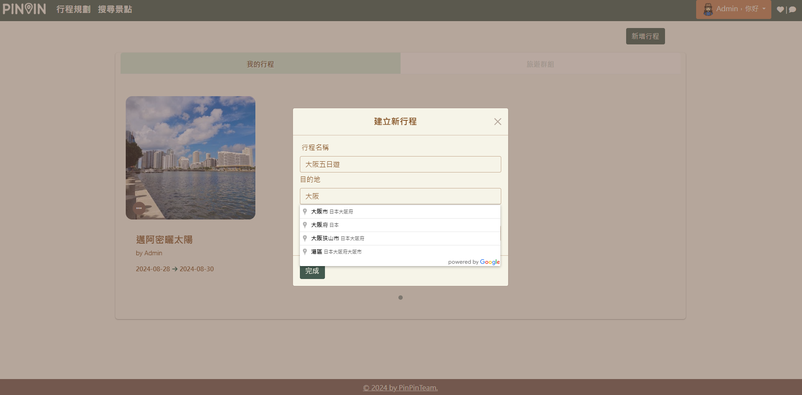
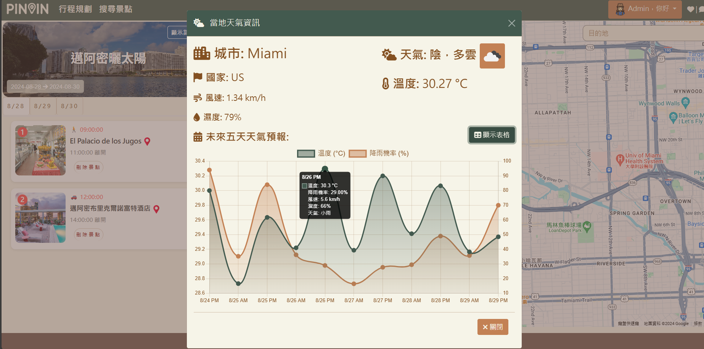

# PinPin

`目前正在重構前端框架中`

## 開發團隊 : PinPinTeam(Pole、Amy、Lynn)

## 簡介

PinPin 平台專為喜愛自由行的用戶設計，提供一站式的景點搜尋、行程規劃和分帳功能。不論是獨自旅行還是結伴同行，PinPin 都能讓用戶輕鬆規劃專屬行程，無需頻繁切換不同網站，一站完成所有安排，提升旅行的便捷性和樂趣。

## 發想動機

旅行就該隨心所欲，不受束縛！隨著旅遊資訊的取得成本降低，越來越多人加入自由行的行列。

PinPin 平台以協助規劃自由行的用戶為出發點，提供景點搜尋、行程規劃以及分帳功能。

不論是獨自出遊或是結伴旅行，都能透過 PinPin 一站完成，省去不同網站間切換的不便，更輕鬆地規劃一場專屬於自己和同伴的旅行

## 功能特色

### 組團旅遊

用戶可以創建我們網站的會員，並邀請同為會員的朋友加入組團旅遊計劃，與朋友或其他旅伴一起計劃行程，團長可以控制每位會員權限(可否編輯、剔除他人)，並且有一個專屬於此形成的聊天室，讓用戶可以在這個網站就能夠討論旅行計畫。

    
    
    

### 喜好清單

用戶可以建立專屬於自己的喜好清單，將他們感興趣的景點、餐廳、活動等，透過我們的地點搜尋功能(**Google Places API**)，加入列表喜好清單，以便隨時參考或作為行程規劃的靈感來源。該功能可幫助用戶保存他們想要參觀或體驗的地方，也能夠替這些地點分類，並在日後輕鬆加入旅遊行程。

    
    

### 行程規劃

透過用戶創建行程時給予的資料創建行程(**Google Places Autocomplete API**)，並獲取當地的地點，提供靈活的行程規劃工具，幫助行程中的團員們共同自定義每日行程的安排。該功能支持使用 **Google Maps API**，幫助用戶規劃最佳路線，並考慮到交通時間和地點距離。行程規劃還能根據當地天氣資訊（來自 OpenWeather API）提供天氣預報，幫助用戶提前做相關準備。

    
    
    

### 分帳功能

針對多人旅遊中的費用分攤問題，分帳功能可以幫助團隊成員紀錄分配支出。用戶可以記錄各種開支，無論是何種幣別(**ExChangeRate API**)，並自動換匯計算每個成員最後結算的金額，幫助用戶了解與團員間的分帳關係。這個功能減少了財務分配的麻煩，讓用戶能專注於享受旅程。

    
    

## 使用技術

### 前端

- **HTML/CSS**: 網頁結構和樣式設計，使用標準的 HTML 和 CSS 進行頁面佈局與美化。

- **Bootstrap**: 基於網格系統的 CSS 框架，用於響應式設計和快速樣式化頁面元件。

- **Vue.js**：用於構建前端的組件化架構，提供高效的數據綁定和狀態管理。

- **Axios**：用於前端進行 API 請求，獲取後端或第三方 API 的數據。

### 後端

- **ASP.NET Core WebAPI**: 用於構建 RESTful API，支援前端應用程序通過 HTTP 協議與伺服器進行互動。

- **Entity Framework Core**: 用於與 SQL Server 進行資料庫交互的 ORM (Object-Relational Mapping) 工具，簡化資料存取邏輯。

- **SQL Server**: 後端資料庫管理系統，用於存儲和管理應用程序的資料。

### 其他工具

#### 第三方 API

- **Google Maps API**: 用於在網站中嵌入地圖，並提供定位和路徑規劃等地理信息服務。

- **OpenWeather API**: 提供實時天氣資訊的 API，用於顯示特定地區的氣候數據。

- **ExChangeRate API**: 用於獲取最新的匯率資訊，實現貨幣兌換功能。

#### 即時通訊

- **SignalR(WebSocket)**: 支援實時雙向通訊的協議，用於實現即時資料推送和更新。

#### 版本控制

- **GitHub**: 用於專案的版本控制和協作開發，管理專案的源代碼和分支。

## 版權聲明

此專案 **PinPin** 僅供學習與研究使用，無任何商業用途。專案中使用的圖片、圖標及其他資源均屬於其原始版權所有者，版權和使用權歸於創作者。

- **版權歸屬**：本專案所使用的圖片、圖標、以及其他素材的版權均屬於其各自的創作者或版權擁有者。本專案對這些內容並不擁有任何權利，這些素材僅被用於教育和學習之目的。

- **學習用途** : 此專案旨在作為程式設計和網站開發的教學範例使用，不應被用作商業項目或公開發布於營利性平台上。任何基於此專案的複製、修改、或使用，均需遵守相應素材的版權規範。

- **免責聲明** : 本專案的開發者不對使用此專案或專案內容而引發的任何法律問題負責。如果你計劃將本專案的內容用於商業用途，請確保獲得所有相關素材的合法許可。
